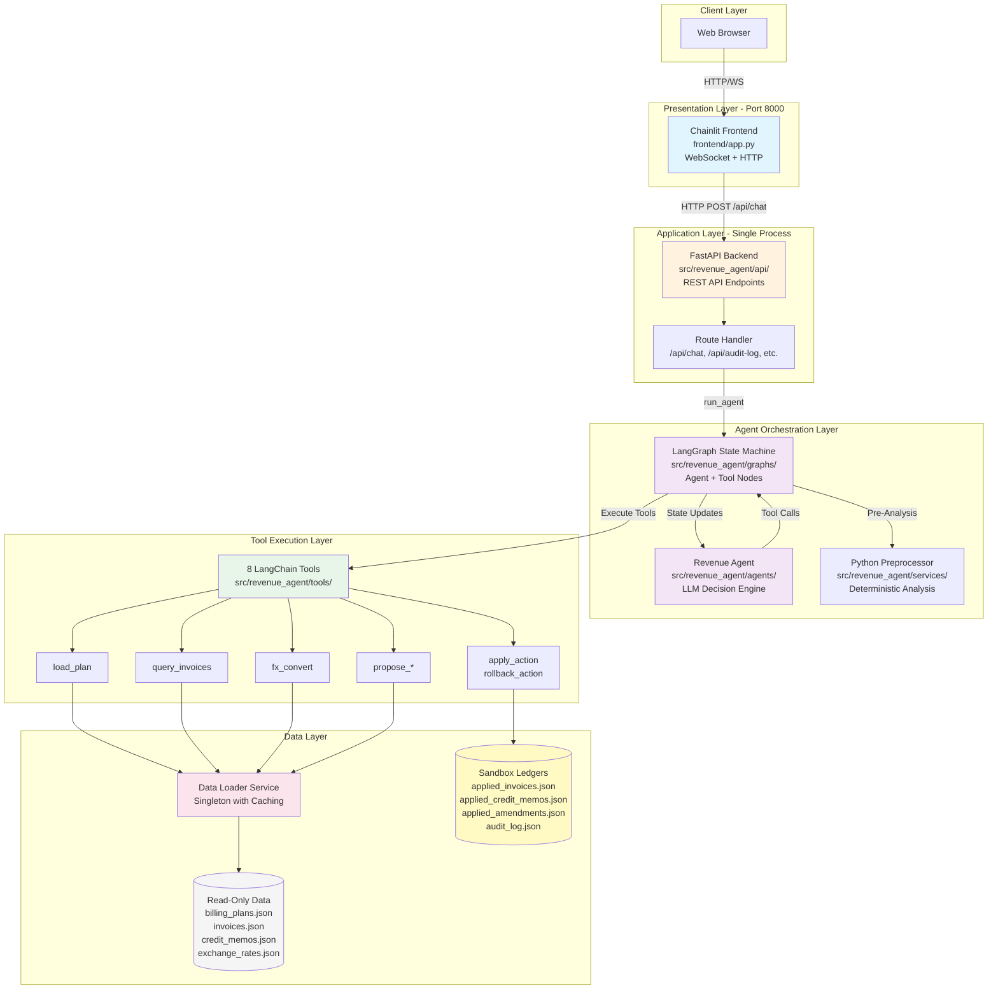
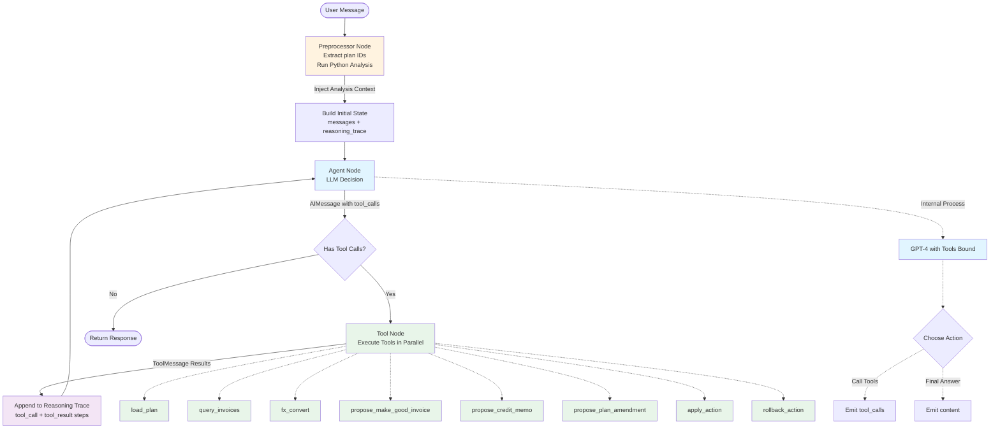

# Revenue Leakage Agent

An AI-powered financial detective that investigates billing anomalies and revenue leakage issues between billing plans and invoices.

## Features

- **Investigate Anomalies**: Detect discrepancies between billing plans and issued invoices
- **Propose Corrective Actions**: Generate make-good invoices, credit memos, or plan amendments
- **Apply with Approval**: Write changes to a sandbox environment with human-in-the-loop approval
- **Conversational Interface**: Natural language chat interface for investigations
- **Audit Trail**: Full audit log of all applied actions

## Architecture

### System Architecture & Microservices



**Key Architectural Decisions:**

1. **Single-Port Architecture**: Chainlit UI is mounted inside FastAPI using `mount_chainlit()` - everything runs on port 8000
2. **Stateful Conversation**: LangGraph uses `MemorySaver` checkpointer for conversation memory across turns
3. **Hybrid Analysis**: Python preprocessor runs deterministic date calculations before LLM sees the message
4. **Sandbox Pattern**: All write operations go to separate sandbox files, read-only data remains immutable
5. **Tool-Based Actions**: Agent uses LangChain tools for all I/O operations (no direct data access)

---

### LangGraph Agent Flow



**State Management:**
- `messages`: List of conversation messages (HumanMessage, AIMessage, ToolMessage, SystemMessage)
- `reasoning_trace`: List of trace steps (pre_analysis, llm_decision, tool_call, tool_result)
- `pending_action`: ActionDraft awaiting approval
- `needs_approval`: Boolean flag for human-in-the-loop
- `context`: Dictionary for accumulated conversation context

**LangGraph Flow Explanation:**

1. **Preprocessing Phase**: 
   - User message arrives → Preprocessor extracts plan IDs (regex: `P-\d+`)
   - If investigation keywords detected → Run Python analysis (`services/analysis.py`)
   - Inject pre-computed analysis as SystemMessage context

2. **Agent Loop** (repeats until final answer):
   - **Agent Node**: LLM receives messages + system prompt → decides to call tools OR produce final response
   - **Routing**: `should_continue()` checks if `AIMessage.tool_calls` exists
   - **Tool Node**: Execute all tool calls in parallel → return `ToolMessage` results
   - **Trace Logging**: Every step appends to `reasoning_trace` (pre_analysis, llm_decision, tool_call, tool_result)

3. **State Persistence**:
   - `MemorySaver` checkpointer stores state per `thread_id`
   - `reasoning_trace` uses `operator.add` reducer → automatically concatenates lists from each node
   - Conversation memory maintained across multiple turns

4. **Tool Execution**:
   - Tools are LangChain `@tool` decorated functions
   - Proposal tools store pending actions in-memory → return `action_id`
   - `apply_action` retrieves pending action by ID → writes to sandbox JSON files
   - All tools return structured dicts (RORO pattern)

5. **Response Assembly**:
   - Final `AIMessage.content` extracted as response text
   - `reasoning_trace` list returned alongside response
   - API exposes both in `ChatResponse` → Chainlit renders trace as expandable steps

## Project Structure

```
fos/
├── src/revenue_agent/
│   ├── agents/           # Agent policies and prompts
│   ├── api/              # FastAPI routes
│   ├── graphs/           # LangGraph graph definitions
│   ├── schemas/          # Pydantic models
│   ├── services/         # Data loading and business logic
│   ├── tools/            # LangChain tools
│   ├── config.py         # Settings
│   └── main.py           # FastAPI app
├── frontend/
│   └── app.py            # Chainlit application
├── data/
│   ├── billing_plans.json
│   ├── invoices.json
│   ├── credit_memos.json
│   ├── exchange_rates.json
│   └── sandbox/          # Writable ledgers
└── tests/
```

## Setup

### Prerequisites

- Python 3.11+
- OpenAI API key

### Installation

1. Clone the repository and navigate to the project:
   ```bash
   cd fos
   ```

2. Create a virtual environment:
   ```bash
   python -m venv .venv
   source .venv/bin/activate  # On Windows: .venv\Scripts\activate
   ```

3. Install dependencies:
   ```bash
   pip install -e .
   ```

4. Configure environment variables:
   ```bash
   # Edit .env file
   OPENAI_API_KEY=your-api-key-here
   ```

## Running the Application

### Option 1: Chainlit Frontend (Recommended)

```bash
cd frontend
chainlit run app.py
```

Then open http://localhost:8000 in your browser.

### Option 2: FastAPI Backend Only

```bash
python -m revenue_agent.main
```

API documentation available at http://localhost:8000/docs

## Available Tools

| Tool | Purpose |
|------|---------|
| `load_plan(plan_id)` | Load billing plan details |
| `query_invoices(...)` | Filter invoices by plan, customer, dates |
| `fx_convert(...)` | Currency conversion |
| `propose_make_good_invoice(...)` | Draft new invoice for missed billing |
| `propose_credit_memo(...)` | Draft credit memo for overbilling |
| `propose_plan_amendment(...)` | Draft billing plan update |
| `apply_action(...)` | Apply proposed action to sandbox |
| `rollback_action(...)` | Undo applied action |

## Sample Data Scenarios

The sample data includes several revenue leakage scenarios:

1. **P-12345 (Acme Corporation)**: Missing October invoice - $10,000 gap
2. **P-67890 (Global Tech Ltd)**: Currency mismatch - invoiced in USD instead of EUR
3. **P-33333 (British Innovations)**: Overbilling - September invoice £3,000 over plan amount

## Example Conversation

```
User: Can you check if there are any revenue leakage issues with plan P-12345?

Agent: I'll investigate plan P-12345 for you. Let me load the plan details and check the invoices...

I found a discrepancy! Plan P-12345 should bill $10,000 monthly, but I only see invoices for:
- September 2024: $10,000 ✓
- November 2024: $10,000 ✓

October 2024 is missing! This represents $10,000 in missed revenue.

User: Can you create a make-good invoice for the missing October billing?

Agent: I'll propose a make-good invoice for $10,000 USD for the missing October 2024 billing period.
Would you like me to apply this to the sandbox?

User: Yes, apply it.

Agent: Make-good invoice INV-MG-ABC123 has been applied to the sandbox.
```

## API Endpoints

- `POST /api/chat` - Send message to agent
- `GET /api/audit-log` - View audit log
- `GET /api/sandbox/invoices` - View applied invoices
- `GET /api/sandbox/credit-memos` - View applied credit memos
- `GET /api/sandbox/amendments` - View applied amendments
- `POST /api/sandbox/reset` - Reset sandbox to empty state
- `GET /api/plans` - List all billing plans
- `GET /api/health` - Health check

## Development

### Running Tests

```bash
pytest
```

### Code Quality

```bash
ruff check src/
ruff format src/
```

## License

MIT
